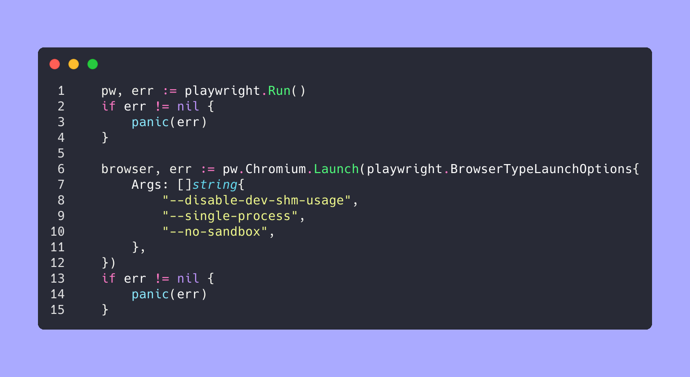

# Docker base image for [playwright-go](https://github.com/playwright-community/playwright-go)

# Instruction

To use this base image, please specify followng arguments of `RunOptions` and `BrowserTypeLaunchOptions`.

